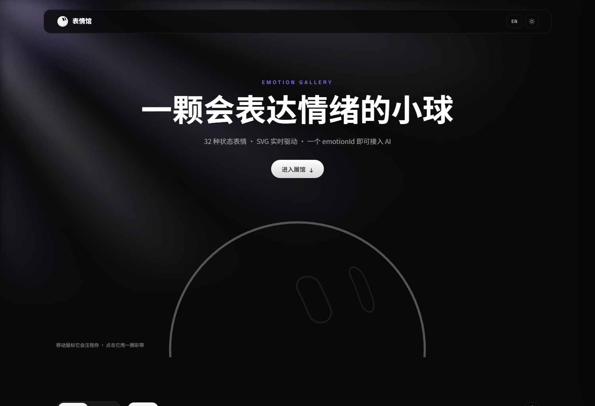
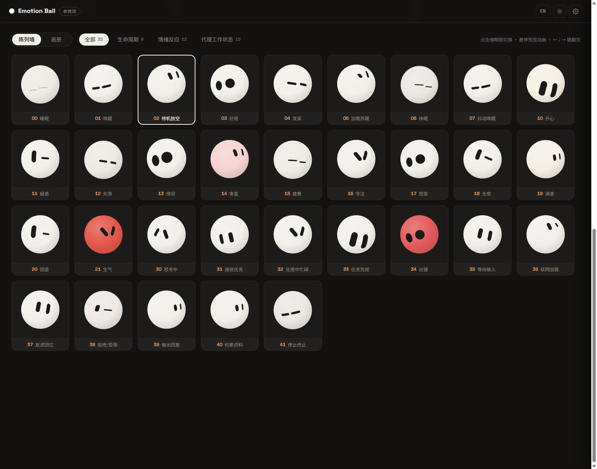
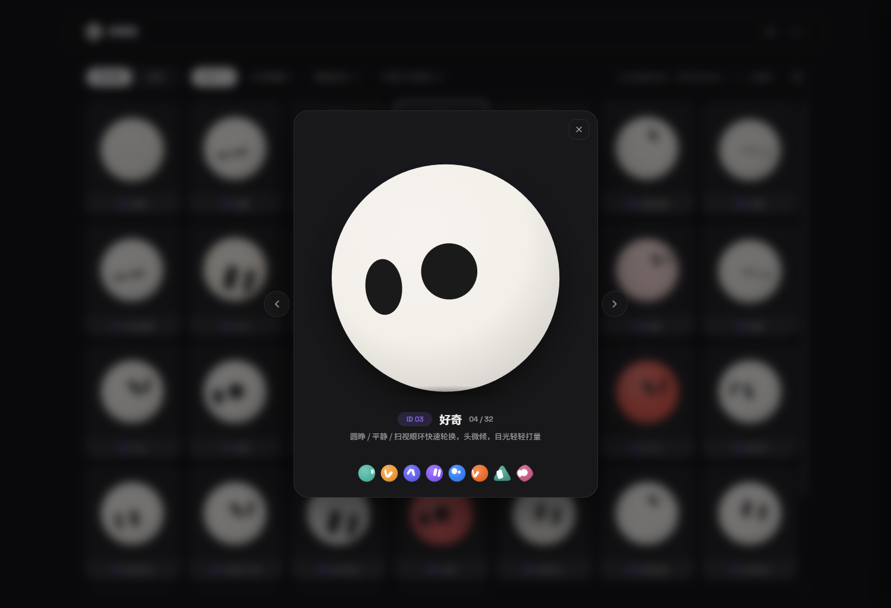
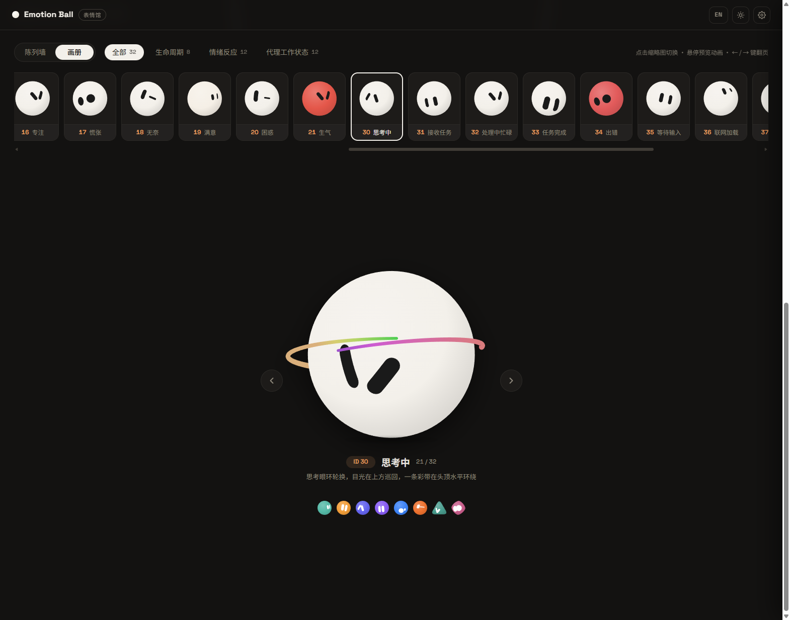

<div align="center">

# Emotion Ball Gallery

**A Grok-bot-style AI emotion ball — 32 expressions · pure SVG + vanilla JavaScript · zero dependencies**

[](https://emotion-balls.vercel.app/)
[](LICENSE)
[](#)
[](#)

[中文](README.md) | **English**

[Live demo](https://emotion-balls.vercel.app/) · [Features](#features) · [Quick start](#quick-start) · [SDK usage](#sdk-usage) · [License](#license)

</div>

---

A Grok-bot-style AI emotion ball: 32 expressive states rendered in pure SVG + vanilla JavaScript — no frameworks, no image assets. Your AI only needs to output a single `emotionId` and the ball switches to the matching expression; it also works as the expression engine for a desktop pet / floating assistant. Ships with a complete gallery site: a wireframe hero opening, wall / album view modes, bilingual UI and dark / light themes.

## Preview

| Hero (dark) | Light theme · English |
| :---: | :---: |
|  |  |

| Wall mode | Stage lightbox |
| :---: | :---: |
|  |  |



## Features

- **32 emotions** across three groups — Lifecycle (sleeping / waking / idle…), Emotions (happy / shy / angry / surprised…) and Agent States (thinking / searching / error / done…) — all config-driven
- **Segmented emotionId scheme**: the tens digit is the group prefix — `00-09` Lifecycle, `10-29` Emotions, `30-49` Agent States, `50+` Custom; gaps between groups are reserved slots for future emotions and existing IDs are never renumbered, so integrations can hard-code them safely
- **Contour-ring eye system**: 25 sets of 48-point eye contours, point-by-point spring morphing, expression-pool rotation and overshooting blink keyframes
- **Spherical projection**: eyes follow the body silhouette with longitude mapping + cosine compression, hide automatically when spun to the back; blob / wedge / gem body shapes
- **Ribbons & confetti**: spin-triggered 3D orbital ribbon trails with 5-stop hue gradients, a persistent halo ribbon for the thinking state, and physics-based confetti bursts
- **Mouse gaze**: page-wide gaze tracking with frame-rate-independent smoothing, plus constant subtle eye wander
- **Gallery site**: wall mode (grid + click-to-open lightbox) and album mode (horizontal strip + big stage with paging), settings drawer, auto tour, Chinese / English, dark / light themes, all preferences persisted in localStorage
- **AI integration**: one line — `ball.handleAIMessage('{"emotionId":"30","tips":"thinking"}')` — with automatic fallback for unknown IDs
- **Zero dependencies**: HTML + SVG + vanilla JS, ready to drop into an Electron floating window

## Quick start

```bash
# any static server works, e.g.:
python -m http.server 8765
# open http://localhost:8765/
```

Or just open `index.html` directly (a local server is recommended so Google Fonts load).

## Project layout

```
emotion-ball/
├── index.html          # site entry: hero + gallery + settings drawer
├── css/style.css       # dual-theme variables, dual-mode layouts
├── js/
│   ├── rings.js        # geometry data: 25 eye rings + 3 body silhouettes
│   ├── emotions.js     # 32 emotion configs (pure data, zh + en copy)
│   ├── i18n.js         # UI string dictionary (zh / en)
│   ├── ball.js         # render layer: SVG, spherical projection, ribbons, confetti
│   ├── engine.js       # engine layer: state machine, springs, expression pool, SDK
│   └── app.js          # interaction layer: the gallery site shell
├── assets/
│   ├── img/            # favicon
│   └── screenshots/    # README preview screenshots
└── .cursor/skills/     # AI collaboration skills: emotion design + integration
```

## SDK usage

```js
// create an instance
const ball = EmotionBall.create(el, {
  emotion: '02',            // initial emotion
  shape: 'blob',            // blob / wedge / gem
  color: '#54B9A6',         // optional: themed instance (team bots)
  idle: true                // optional: idle policy (auto standby / sleep)
});

// AI integration: a single emotionId is enough
ball.handleAIMessage({ emotionId: '30', tips: 'thinking…' });

// more capabilities
ball.setEmotion('10');            // switch directly
ball.spin(2);                     // spin & throw ribbons
ball.burst(20);                   // confetti
ball.setStyle({ sketch: 1 });     // wireframe mode
ball.startTour(['00','10','30']); // auto tour
ball.on('change', e => console.log(e.id));

// config registry
EmotionBall.config.register({ id: '50', name: 'Custom', group: 'custom', ... });
EmotionBall.config.exportConfig(); // export all emotions as JSON
```

## Emotion config format

```js
{
  id: '10', name: '开心', group: 'emotion',
  desc: '笑眼轮换,目光下看看、上看看',
  en: { name: 'Happy', desc: '...' },
  pool: [2, 11, 17, 19],      // eye-ring pool, rotated randomly within poolMs
  blinkMs: [2500, 5000],      // blink interval (null = never)
  antics: true,               // random idle antics (spin / bounce)
  body: { breathe: 0.014 },   // breathing, color, zzz, halo ribbon, etc.
  anims: [ { target: 'eyes', prop: 'lookY', type: 'glance', amp: 6, period: 3000 } ],
  sequence: { ... }           // optional entry keyframe sequence
}
```

## License

This project is **dual-licensed**:

- **Community license (default)**: for personal learning, research and technical exchange only — **any commercial use is prohibited**. Please credit the source when sharing non-commercially. See [LICENSE](LICENSE).
- **Commercial license**: required for any commercial use (integration into commercial products or services, closed-source derivative development, paid delivery, etc.). See [LICENSE-COMMERCIAL.md](LICENSE-COMMERCIAL.md) for the general terms and [docs/LICENSING.md](docs/LICENSING.md) for use cases and how to purchase.

For commercial licensing and partnerships, email: **1251579308@qq.com**
