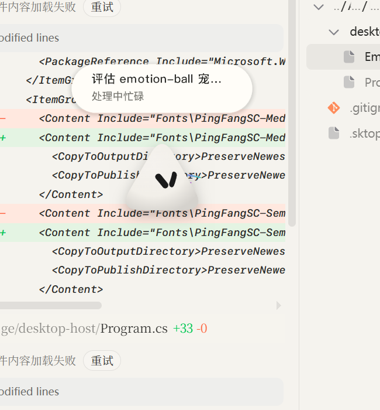

# Emotionball-Deskpet

[简体中文](README.md) | [English](README.en.md)

一个会感知 Codex 与当前 Windows 应用状态的透明桌面宠物。

> 本项目是基于 [sam70361/emotion-ball](https://github.com/sam70361/emotion-ball) 制作的 Windows 桌面端衍生项目，不是原项目的官方版本，也不建议称为“复刻”。原项目提供 SVG 小球、表情系统与动画引擎；本项目增加 Windows 桌面宿主、Codex 状态桥接、本地应用状态、气泡、托盘与便携交付。



[下载最新 Windows 版本](https://github.com/Vyenkor/Emotionball-Deskpet/releases/latest)

当前发布版本：**v1.0.4**。本版本新增可选安装目录、安装目录内的卸载程序，并继续收紧安装目录覆盖与安装包路径校验。

## 功能

- Codex 活跃时优先显示任务名称，以及思考、处理、检索、等待、回复、完成等状态。
- Codex 空闲时识别当前前台应用，在本机生成轮换的俏皮文案与对应 SVG 动作。
- 5 秒无输入后进入眯眼待机；再静置 3 秒自动隐藏气泡，移动鼠标即按当前应用状态唤醒。
- 圆胖、三角、菱形三种身体形态。
- 透明、置顶、可拖动；按住左键并滚动滚轮可等比例缩放。
- 双击小球可快速切换置顶；形态、大小和气泡设置变更时，会以单行提示短暂反馈后恢复原状态。
- 气泡可置于桌宠上方或下方，可分别关闭 Codex 气泡和 App 气泡。
- 系统托盘显示后台桥接状态，使用与 EXE 相同的图标。
- 全屏监听鼠标方向，眼睛会根据指针相对桌宠的位置平滑跟随，不受距离范围限制。
- 单实例运行、窗口位置与设置持久化、屏幕边界限制。
- 独立 WebView2 数据目录，并针对 `0x800700AA` 初始化占用错误重试。

## 快速开始

1. 从 [Releases](https://github.com/Vyenkor/Emotionball-Deskpet/releases) 下载 `Emotionball-Deskpet-v*-setup.exe` 或 `Emotionball-Deskpet-v*-win-x64.zip`。
2. 使用安装版时双击 `setup.exe`，在安装窗口中填写或浏览选择安装目录，然后点击“安装”。安装完成后会自动启动桌宠。
3. 使用 ZIP 版时，将 ZIP 完整解压到普通文件夹，再双击其中的 `Emotionball-Deskpet.exe`。
4. 安装版的 `Emotionball-Deskpet-Uninstall.exe` 位于所选安装目录中，双击即可卸载该目录中的桌宠和设置文件。
5. 右键桌宠打开设置菜单；需要退出运行时可从桌宠菜单或系统托盘退出。

安装程序不会强制写入系统目录，默认目录为 `%LOCALAPPDATA%\Emotionball-Deskpet\<版本号>`，也可以在安装时改为其他目录。已有非桌宠文件的目录不会被覆盖。

便携包已包含 x64 .NET 与 Node.js 运行时，不需要安装 Node.js 或 .NET SDK。Windows 仍需提供 Microsoft Edge WebView2 Runtime；多数 Windows 10/11 已自带。

## 操作

| 操作 | 效果 |
| --- | --- |
| 左键拖动 | 移动桌宠，并播放弹跳动作 |
| 按住左键并滚动滚轮 | 等比例放大或缩小 |
| 右键桌宠 | 打开形态、气泡、置顶和退出菜单 |
| 双击桌宠 | 切换始终置顶 |
| Codex 活跃时单击气泡 | 显示临时关闭按钮；仅关闭本次任务气泡 |
| 双击托盘图标 | 将桌宠恢复到可见屏幕区域 |

## 状态与隐私

状态优先级为：`Codex 活跃任务 > 当前前台应用 > 待机`。

- 本地桥接仅监听 `127.0.0.1:8765`。
- Codex 联动只读检查 `%USERPROFILE%\.codex\sessions` 与本地任务标题索引。
- 网页动画层不会收到聊天正文、命令参数、工具输出、Token 或账号凭据。
- 前台窗口标题、窗口类名和 EXE 信息只在桌宠进程内用于分类，不会上传。

Codex Desktop 是可选依赖；没有 Codex 活跃任务时，桌宠仍可使用本地 App 状态模式。

## 常见问题

### 启动后没有出现桌宠

- 确认压缩包已经完整解压。
- 检查托盘中是否已有 Emotionball-Deskpet 图标；双击图标可恢复桌宠。
- 在任务管理器中确认是否已有 `Emotionball-Deskpet.exe`。程序只允许一个实例。
- 安装或修复 [Microsoft Edge WebView2 Runtime](https://developer.microsoft.com/microsoft-edge/webview2/)。

### `请求的资源在使用中 (0x800700AA)`

结束残留的 `Emotionball-Deskpet.exe` 与其 `msedgewebview2.exe`，确认 `%LOCALAPPDATA%\EmotionBallCodex` 可写，然后重新运行。程序使用独立的 `%LOCALAPPDATA%\EmotionBallCodex\WebView2` 数据目录并自动重试一次。

### 重置位置与设置

退出桌宠后删除：

```text
%LOCALAPPDATA%\EmotionBallCodex\window-state.json
```

## 从源码构建

要求：Windows 10/11 x64、.NET 10 SDK、Node.js 18 或更高版本、WebView2 Runtime。

```powershell
npm test
dotnet build .\desktop-host\Emotionball-Deskpet.csproj -c Release
```

生成便携 Release：

```powershell
.\scripts\build-release.ps1 -Version 1.0.4
```

构建脚本会生成精简便携目录、ZIP 与校验文件，同时生成可选择安装目录并附带卸载程序的自释放 `setup.exe`。

## 项目结构

```text
bridge/          Codex 本地状态跟踪与 HTTP/SSE 桥接
desktop-host/    WinForms + WebView2 透明桌面宿主
js/              emotion-ball 动画引擎与桌宠前端逻辑
css/             桌宠和状态页样式
docs/images/     README 宣传截图
scripts/         可复现的 Release 打包脚本
```

## 上游、字体与许可

- 原项目：[sam70361/emotion-ball](https://github.com/sam70361/emotion-ball)，原始设计、SVG 动画引擎、表情数据与相关素材版权归原作者所有。
- 本仓库保留原项目提交历史、`LICENSE`、`LICENSE-COMMERCIAL.md` 与署名，并明确标注桌面端修改。
- 本项目默认受上游“仅供学习交流、禁止商业用途”许可约束。商业使用请按原项目许可联系原作者。
- PingFangSC 文件未随源码或 Release 再分发，因为其参考仓库没有提供可验证的再分发许可证。若系统已安装苹方会优先使用，否则回退到 Windows 自带的 Microsoft YaHei UI。

更多说明见 [许可指南](docs/LICENSING.md) 与 [第三方声明](NOTICE.md)。
